# CareerTracker — Complete Project Walkthrough

> This guide explains every part of the project in a simple, step-by-step way — what it is, what it does, and how it connects to everything else.

---

## 🌐 What Is This Project?

**CareerTracker** (internally called *CareerPath*) is a full-stack web application that helps users plan and track their tech career. It does the following:

| Feature | What It Does |
|---|---|
| 🗺️ AI Roadmap | Generates a personalized skill roadmap for your target job |
| 🧠 Skill Quiz | Tests your knowledge of any skill using AI-generated questions |
| 📄 Resume Builder | Builds and exports an ATS-optimized resume |
| 📁 Projects | Analyzes your GitHub README files using AI |
| 🏆 Certificates | Upload and manage your certifications |
| 👤 Profile | View and manage your personal + career profile |

---

## ⚙️ Technology Stack

### Frontend (what you see in the browser)
- **React** — builds the UI as components
- **React Router** — handles navigation between pages
- **Tailwind CSS** — utility CSS classes for styling
- **Vite** — fast development server

### Backend (the server that powers the app)
- **Node.js + Express** — handles API requests
- **MongoDB + Mongoose** — stores all user data
- **JWT (JSON Web Tokens)** — handles login security
- **bcryptjs** — hashes passwords before saving
- **Groq AI (LLaMA models)** — generates quizzes and roadmap learning paths
- **GitHub API (Octokit)** — fetches real trending skills from GitHub repos
- **Stack Overflow API** — fetches supplementary skill tags
- **Cerebras AI** — analyzes project README files

---

## 🗂️ Root-Level Files (The Outer Shell)

These files sit at the very top of the project folder:

```
careertrackerSTABLE/
├── index.html           ← The single HTML page React loads into
├── vite.config.js       ← Vite (frontend dev server) settings
├── tailwind.config.js   ← Tailwind CSS configuration
├── postcss.config.js    ← Required for Tailwind to work
├── package.json         ← Frontend dependencies list
├── eslint.config.js     ← Code quality rules
├── start_dev.bat        ← Windows script to start both frontend & backend
└── uploads/             ← Stores uploaded certificate files
```

> **`index.html`** — React fills this file's `<div id="root">` with the entire app.

> **`start_dev.bat`** — A Windows batch file that opens two terminals: one for the frontend and one for the backend, so you can run both with one click.

---

## 🎨 Frontend — The `src/` Folder (Step by Step)

The `src/` folder is the entire React application. Here's how each part is laid out and what it does:

### Step 1: `src/main.jsx` — The Starting Point

This is where React begins. It mounts the `App` component into the `index.html`. Think of it as the **on switch** for the React app.

```
main.jsx → loads App.jsx → shows the right page
```

---

### Step 2: `src/App.jsx` — The Router / Map of the App

This file defines **all the URL routes** — it's like a directory that says "if you go to this URL, show this page."

| URL | Page Shown |
|---|---|
| `/` | Home (landing page with "Start Your Journey") |
| `/login` | Login page |
| `/signup` | Multi-step signup page |
| `/profile` | Profile form (fill your details) |
| `/roadmap` | Your personal career roadmap |
| `/quiz/:skill` | Quiz for a specific skill (e.g., `/quiz/React`) |
| `/dashboard` | Main dashboard (protected — needs login) |
| `/dashboard/profile` | Profile view inside dashboard |
| `/dashboard/resume-builder` | Resume builder |
| `/dashboard/certificates` | Certificate manager |
| `/dashboard/projects` | Projects page |

> The dashboard routes are **nested** inside `DashboardLayout`, meaning they all share the same sidebar and top navbar.

---

### Step 3: `src/index.css` — Global Styles

A small CSS file with Tailwind's base directives. All styling is primarily done through Tailwind CSS classes directly in components.

---

### Step 4: `src/layouts/DashboardLayout.jsx` — The Dashboard Shell

This is the **wrapper** for every page inside the dashboard. It provides:
- The **Sidebar** on the left
- The **Top Navbar** (shows your name + logout button)
- The `<Outlet />` — a placeholder where child pages (Dashboard, Profile, etc.) are rendered

**How it works:**
1. When you visit `/dashboard`, React loads `DashboardLayout`
2. It checks if you're logged in (looks for `token` in localStorage)
3. If no token → redirects you to `/login`
4. If logged in → fetches your profile from the API and shows your name in the top navbar
5. The actual page content (e.g., Dashboard or Resume Builder) renders in the `<Outlet />`

---

### Step 5: `src/pages/` — All the Pages

These are the **screens** the user actually sees and interacts with:

#### 🔐 `Login.jsx`
- Shows a login form (username + password)
- On submit → calls `POST /api/auth/login`
- On success → stores the JWT token in `localStorage` and redirects to `/dashboard`

#### 📝 `Signup.jsx`
- A **multi-step form** for new users to register
- Collects: name, email, username, phone, status (Student/Professional), education, experience, social links
- On submit → calls `POST /api/auth/signup`
- On success → stores token and redirects to `/profile` to fill career details

#### 📋 `ProfileForm.jsx`
- A form where users set: current skills, target job, experience level
- Calls `POST /api/profile` to save this
- Then redirects to `/roadmap` to generate a roadmap

#### 🏠 `Dashboard.jsx` *(Biggest file — ~27KB)*
- The **home base** after login
- Shows: skill progress stats, mastered skills, learning skills, skill gap analysis, resume upload, recent activity
- Has interactive skill cards where clicking toggles skill state: **To-Learn → Learning → Mastered**
- Clicking "Start Quiz" on a skill → navigates to `/quiz/SkillName`
- Fetches data from `/api/profile`, `/api/resume/analysis`, and the roadmap

#### 🗺️ `Roadmap.jsx`
- Displays the AI-generated career roadmap
- Shows skills in a visual layout: Mastered (green), Learning (blue), To-Learn (organized by priority)
- Fetches from `GET /api/roadmap`

#### 🧠 `Quiz.jsx`
- Shows a 25-question multiple-choice quiz for a chosen skill
- Fetches questions from `GET /api/quiz/:skill`
- After completion, shows a score and if passed (≥70%), marks the skill as Mastered by calling `/api/profile/toggle-skill`

#### 📄 `ResumeBuilder.jsx`
- Lets users generate, preview, and export their resume
- Uses data from their profile + parsed resume
- Calls the resume API to generate AI-enhanced content

#### 👤 `Profile.jsx`
- Displays all saved user information (name, education, experience, social links, skills)
- Read-only view with edit capabilities

#### 🏆 `Certificates.jsx`
- Upload and manage certification files (PDF/image)
- Calls `/api/cert` routes

#### 📁 `Projects.jsx`
- Upload GitHub README files for AI analysis
- The AI extracts tech stack, key features, and skills from the README
- Displays analyzed projects in cards

---

### Step 6: `src/components/` — Reusable Building Blocks

These are **reusable UI pieces** used across multiple pages:

| File | What It Does |
|---|---|
| `Sidebar.jsx` | Left navigation menu with links to all dashboard pages |
| `Avatar.jsx` | Circular avatar with initials (e.g., "AM" for Amaya) |
| `Skeleton.jsx` | Gray placeholder boxes shown while data loads |
| `SkillGapAnalysis.jsx` | Visual chart/display of skill gap percentage |
| `SkillRoadmap.jsx` | Visual roadmap component (skill nodes in stages) |
| `SkillTooltip.jsx` | Hover tooltip for skill details and resources |
| `ResumeUploadForm.jsx` | Form to upload a PDF resume for parsing |
| `ResumePreview.jsx` | Live preview of the generated resume |
| `profile/` | Sub-components for the Profile page |
| `resume/` | Sub-components for the Resume Builder |

---

## 🔧 Backend — The `server/` Folder (Step by Step)

The backend is a **Node.js + Express** server. It handles all data storage, AI calls, and business logic.

### Step 1: `server/index.js` — The Server Entry Point

This is where the server **starts up**. It:
1. Loads environment variables from `.env`
2. Creates the Express app
3. Applies **middleware** (CORS, JSON parsing, static file serving)
4. Registers all **route files** under `/api/...`
5. Connects to **MongoDB Atlas**
6. Starts listening on port `5000`

```
Request → index.js → correct route file → controller/service → MongoDB/AI → Response
```

---

### Step 2: `server/.env` — Secret Configuration

Contains all private keys (not pushed to GitHub):

```
MONGODB_URI=...       ← MongoDB Atlas connection string
JWT_SECRET=...        ← Secret for signing JWT tokens
GROQ_API_KEY=...      ← Key for Groq AI (LLaMA models)
GITHUB_TOKEN=...      ← Key for GitHub API
```

---

### Step 3: `server/models/` — The Database Schemas

These define the **shape of your data** in MongoDB.

#### `User.js` — The Main (and Only) User Model

This is the most important file in the backend. **Every piece of user data** is stored in this single MongoDB document. Here's what it stores:

```
User {
  username, email, fullName, phoneNumber, password (hashed)
  personalDetails: { dob, gender, nationality, location }
  currentStatus: "Student" or "Working Professional"
  education: [ { degree, college, startYear, endYear } ]
  experience: [ { company, role, dates, responsibilities } ]
  socialLinks: { github, linkedin, portfolio }

  profile: {
    currentSkills: ["React", "Node.js"]   ← skills user entered
    targetJob: "Frontend Developer"
    experienceLevel: "Junior"
    completedSkills: [ { skill, score, masteredAt } ]   ← quiz-passed skills
    learningSkills: ["Docker"]             ← in-progress skills
    focusSkill: "React"                    ← starred skill
    roadmapCache: { data, generatedAt }    ← cached roadmap (avoid re-generation)
  }

  resumeFile: { filename, filePath, uploadedAt }
  resumeData: { skills, tools, projects, experience, education, certifications }
  skillAnalysis: { matchingSkills, missingSkills, suggestedSkills }
  certifications: [ { title, issuer, fileUrl, ... } ]
  projects: [ { projectName, summary, techStack, keyFeatures } ]
  resumeVersions: [ { versionName, template, content } ]
}
```

#### `SkillDetail.js`
Stores detailed information about individual skills (descriptions, resources).

---

### Step 4: `server/middleware/authMiddleware.js` — Security Guard

This is a **security checkpoint** for every protected route. Here's how it works:

1. Every request to a protected API must include a header: `Authorization: Bearer <token>`
2. The middleware **decodes** the JWT token
3. If valid → extracts `userId` and attaches it to the request
4. If invalid or missing → returns `401 Unauthorized`

Think of it like a **bouncer at a club** — only let people in with a valid wristband (token).

---

### Step 5: `server/routes/` — The API Endpoints

Each file defines a set of API endpoints for a specific feature:

#### 🔐 `auth.js` — Login & Signup

| Method | URL | What It Does |
|---|---|---|
| POST | `/api/auth/signup` | Creates a new user, hashes password, returns JWT |
| POST | `/api/auth/login` | Validates credentials, returns JWT |

**Signup flow:**
1. Validate all required fields
2. Check if username/email already exists
3. Hash the password using `bcrypt`
4. Save new user to MongoDB
5. Generate a JWT token (valid 7 days)
6. Return the token + basic user info

---

#### 👤 `profile.js` — Profile Management

| Method | URL | What It Does |
|---|---|---|
| GET | `/api/profile` | Returns the full user profile |
| POST | `/api/profile` | Saves/updates skills, target job, experience level |
| POST | `/api/profile/toggle-skill` | Cycles a skill: To-Learn → Learning → Mastered |
| POST | `/api/profile/focus-skill` | Stars/Unstars a skill as the focus skill |

**Toggle skill logic:**
```
Not in any list  →  add to "Learning"
In "Learning"    →  move to "Mastered"
In "Mastered"    →  remove (back to To-Learn)
```

---

#### 🗺️ `roadmap.js` — Career Roadmap Generation

| Method | URL | What It Does |
|---|---|---|
| GET | `/api/roadmap` | Returns a personalized skill roadmap |

**How the roadmap is generated (step by step):**
1. Checks if a **cached roadmap** still exists and is up to date
2. If fresh cache → returns it instantly (no AI call needed)
3. If stale or missing → generates a fresh roadmap:
   - Fetches popular skills from **GitHub API** (searches top repos for the job)
   - Fetches supplementary tags from **Stack Overflow API**
   - Combines and deduplicates skills
   - Identifies **missing skills** (required - mastered)
   - Calls **Groq AI (LLaMA 70B)** to generate priority, timelines, and resources for missing skills
   - Fetches beginner GitHub project suggestions
4. Saves the new roadmap to the database as a cache
5. Returns the full roadmap data

---

#### 🧠 `quiz.js` — Quiz Generation

| Method | URL | What It Does |
|---|---|---|
| GET | `/api/quiz/:skill` | Generates 25 AI quiz questions for the given skill |

**How quizzes work:**
1. Calls `generateQuiz(skill)` from `quizGenerator.js`
2. Uses **Groq AI (LLaMA 8B instant)** to create 25 MCQs
3. The prompt enforces: mixed difficulty, no repeat questions on retry, diverse question types (conceptual, code output, debugging)
4. If AI fails or rate-limits → falls back to pre-written questions in `data/fallbackQuiz.js`
5. Maps `correctOption` (letter A/B/C/D) to the actual answer text for the frontend

---

#### 📄 `resume.js` — Resume Features

| Method | URL | What It Does |
|---|---|---|
| POST | `/api/resume/upload` | Uploads and parses a PDF resume |
| GET | `/api/resume/analysis` | Returns skill gap analysis |
| POST | `/api/resume/generate` | Generates an AI-enhanced resume |
| POST | `/api/resume/export` | Exports resume as PDF or DOCX |

---

#### 🏆 `certificate.js` — Certificates

| Method | URL | What It Does |
|---|---|---|
| POST | `/api/cert/upload` | Uploads a certificate file |
| GET | `/api/cert` | Lists all certificates |
| DELETE | `/api/cert/:id` | Deletes a certificate |

---

#### 📁 `projects.js` — AI Project Analysis

| Method | URL | What It Does |
|---|---|---|
| POST | `/api/projects/analyze` | Analyzes a GitHub README with Cerebras AI |
| GET | `/api/projects` | Returns all analyzed projects |
| DELETE | `/api/projects/:id` | Deletes a project |

---

#### 🔗 `skillDetail.js` — Skill Details

| Method | URL | What It Does |
|---|---|---|
| GET | `/api/skills/:skill` | Returns detailed info about a specific skill |

---

### Step 6: `server/services/` — The Business Logic Layer

Services contain the **actual logic** that routes call. They are separated from routes to keep things organized:

| File | What It Does |
|---|---|
| `roadmapGenerator.js` | Fetches GitHub/StackOverflow skills, calls Groq AI for learning path |
| `quizGenerator.js` | Calls Groq AI to generate 25 MCQs for any skill |
| `resumeParserService.js` | Extracts text from PDF uploads using pdf-parse |
| `resumeAnalyzerService.js` | Analyzes parsed resume against target job skills |
| `resumeGeneratorService.js` | Generates AI-enhanced resume content |
| `exportService.js` | Converts resume data to PDF/DOCX format |
| `certificateService.js` | Handles certificate file storage logic |
| `aiEnhancementService.js` | AI-powered text enhancement for resume content |
| `cerebrasService.js` | Calls Cerebras AI API for project README analysis |
| `githubProjectService.js` | Fetches GitHub project suggestions |

---

### Step 7: `server/controllers/` — Additional Controllers

| File | What It Does |
|---|---|
| `resumeController.js` | Orchestrates resume upload, parsing, and generation (called from resume routes) |
| `certificateController.js` | Handles certificate upload and management logic |

---

### Step 8: Other Backend Files

| File | What It Does |
|---|---|
| `server/config/` | MongoDB/database configuration helpers |
| `server/data/` | Contains `fallbackQuiz.js` — pre-written quiz questions used when AI fails |
| `server/utils/` | Shared utility/helper functions |
| `server/tests/` | Test scripts for backend functions |
| `server/check_skills.js` | Debug script to inspect skills in the database |
| `server/debug_server.js` | A minimal server for debugging purposes |
| `server/test-key.js` | Script to test if your API keys are working |
| `server/signup_debug.log` | Auto-generated log file that records every signup request |

---

## 🔄 How the Full Flow Works (End to End)

Here's the complete journey of a user:

```mermaid
flowchart TD
    A["User visits /"] --> B["Clicks 'Start Your Journey'"]
    B --> C["Goes to /signup — fills multi-step form"]
    C --> D["POST /api/auth/signup → JWT token saved"]
    D --> E["Goes to /profile — sets target job + skills"]
    E --> F["POST /api/profile → skills saved to MongoDB"]
    F --> G["Goes to /roadmap"]
    G --> H["GET /api/roadmap"]
    H --> I["GitHub API + StackOverflow → find required skills"]
    I --> J["Groq AI (LLaMA 70B) → generate learning path"]
    J --> K["Roadmap shown with Mastered / Learning / To-Learn skills"]
    K --> L["User clicks 'Start Quiz' on a skill"]
    L --> M["GET /api/quiz/SkillName"]
    M --> N["Groq AI (LLaMA 8B) → generates 25 MCQs"]
    N --> O["User completes quiz — scores ≥ 70%"]
    O --> P["POST /api/profile/toggle-skill → skill marked Mastered"]
    P --> Q["Dashboard updates stats automatically"]
```



---

## 🛡️ Authentication Flow

```
User logs in → Server verifies password → Creates JWT → Token stored in localStorage
    ↓
Every API request → Sends token in header → Middleware verifies JWT → Returns user data
    ↓
Logout → Token deleted from localStorage → User redirected to /login
```

The token is **never stored in the database** — it's created and verified using a secret key (`JWT_SECRET`). It expires after 7 days.

---

## 📦 Summary of Key Connections

```
src/pages/Login.jsx
    └─ calls → POST /api/auth/login (server/routes/auth.js)
               └─ queries → MongoDB User model

src/pages/Roadmap.jsx
    └─ calls → GET /api/roadmap (server/routes/roadmap.js)
               └─ uses → server/services/roadmapGenerator.js
                         ├─ GitHub API (real trending skills)
                         ├─ StackOverflow API
                         └─ Groq AI (learning path descriptions)

src/pages/Quiz.jsx
    └─ calls → GET /api/quiz/:skill (server/routes/quiz.js)
               └─ uses → server/services/quizGenerator.js
                         └─ Groq AI (25 MCQs)

src/pages/Dashboard.jsx
    └─ calls → GET /api/profile (server/routes/profile.js)
               POST /api/profile/toggle-skill
               GET /api/resume/analysis
```
