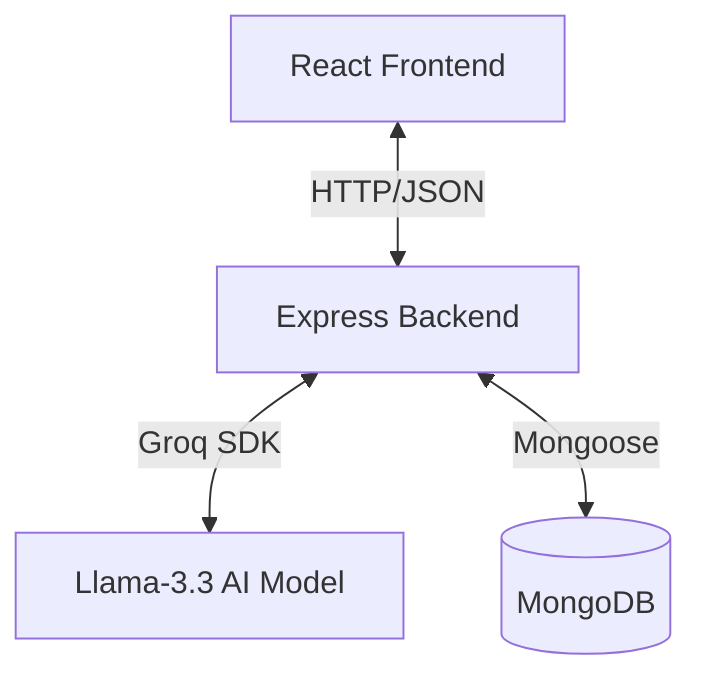

# Quiz System Documentation

This document provides a comprehensive overview of the Quiz System in the Career Tracker application. It covers the architecture, data flow, and implementation details of both the frontend and backend components.

## 1. System Overview

The Quiz System is designed to assess a user's mastery of specific technical skills. It dynamically generates 25 Multiple Choice Questions (MCQs) using an AI model (Llama-3.3-70b via Groq) based on the selected skill. Users must achieve a score of 90% (23/25) to pass and earn a "Mastered" status for that skill.

## 2. Architecture

The system follows a standard Client-Server architecture:



### Key Components

| Component | File Path | Description |
|-----------|-----------|-------------|
| **Frontend UI** | `src/pages/Quiz.jsx` | Handles quiz display, user interaction, timer (visual only), and local scoring. |
| **Backend Route** | `server/routes/quiz.js` | Defines the API endpoint for fetching quizzes. |
| **Quiz Service** | `server/services/quizGenerator.js` | Manages AI integration, prompt engineering, and fallback logic. |
| **Profile Route** | `server/routes/profile.js` | Handles updating user profile upon successful quiz completion. |

## 3. Frontend Implementation (`Quiz.jsx`)

The frontend is built with React and Tailwind CSS. Key features include:

### State Management
- `questions`: Array of 25 question objects fetched from the server.
- `currentQuestionIndex`: Tracks the user's progress.
- `selectedAnswers`: Object mapping question IDs to selected options.
- `isSubmitted`: Boolean flag to toggle between quiz view and result view.
- `result`: Stores the final score and pass/fail status.

### Logic Flow
1.  **Initialization**: On component mount, `useEffect` triggers `fetchQuestions(skill)`.
2.  **Fetching**: Calls `GET /api/quiz/:skill`. Shows a loading spinner while waiting for the AI to generate questions.
3.  **Interaction**: User selects answers. Navigation is handled by `handleNext` and `handlePrev`.
4.  **Submission**:
    *   Scores are calculated locally: implementation matches selected answers against `correctAnswer`.
    *   Pass threshold is **23/25 (92%)**. *(Note: Code says >90%, 23 is the cutoff)*.
    *   If passed, `confetti` animation triggers, and a `POST /api/profile/toggle-skill` request is sent to update the user's profile.

## 4. Backend Implementation

### API Routes (`server/routes/quiz.js`)
-   **GET `/api/quiz/:skill`**:
    *   **Auth**: Protected by `authMiddleware` (requires valid JWT).
    *   **Logic**: Calls `generateQuiz(skill)` service.
    *   **Response**: returns `{ questions: [...] }`.

### Quiz Generation Service (`server/services/quizGenerator.js`)
This service handles the core logic of question generation.

1.  **AI Integration**: Uses `groq-sdk` to communicate with the `llama-3.3-70b-versatile` model.
2.  **Prompt Engineering**: A structured prompt instructs the AI to:
    *   Act as a technical examiner.
    *   Generate exactly 25 MCQs.
    *   Return strict JSON format.
    *   Include `id`, `question`, `options`, and `correctAnswer`.
3.  **Response Parsing**:
    *   Cleans Markdown code blocks (````json ... ````) from the response.
    *   Parses the JSON string.
    *   Validates the structure to ensure it contains an array of questions.
4.  **Fallback Mechanism**:
    *   Catches errors (JSON parse errors, rate limits, API failures).
    *   If an error occurs (especially HTTP 429 Rate Limit), it loads a static quiz from `server/data/fallbackQuiz.js` to ensure the application remains usable.

## 5. Data Flow Example

1.  **User Action**: Clicks "Take Quiz" for "React".
2.  **Request**: Frontend sends `GET /api/quiz/React` with JWT.
3.  **Processing**:
    *   Backend validates token.
    *   `quizGenerator` sends prompt to Groq AI: "Create a certification test for the skill: React...".
    *   Groq returns JSON string with 25 React questions.
4.  **Response**: Backend sends JSON to frontend.
5.  **User takes quiz**: Answers 25 questions.
6.  **Submission**:
    *   User clicks "Submit".
    *   Frontend matches answers: `score = 24`.
    *   Result: **Passed**.
    *   Frontend sends `POST /api/profile/toggle-skill` { skill: 'React' }.
    *   Backend updates User document: adds 'React' to `masteredSkills`.

## 6. Configuration

The system relies on the following environment variables in `.env`:

*   `GROQ_API_KEY`: API key for Groq AI service.
*   `MONGODB_URI`: Connection string for MongoDB.
*   `JWT_SECRET`: Secret for signing authentication tokens.

## 7. Future Improvements (Suggested)

1.  **Server-Side Scoring**: Currently, answers are checked on the client side. Moving this to the backend would prevent users from inspecting network traffic to find correct answers.
2.  **Quiz History**: Store past quiz results in the database to track user improvement over time.
3.  **Dynamic Difficulty**: Adjust question difficulty based on user's previous attempts or self-reported level.
4.  **Timer Enforcement**: Move the timer logic to the backend to prevent client-side manipulation.
