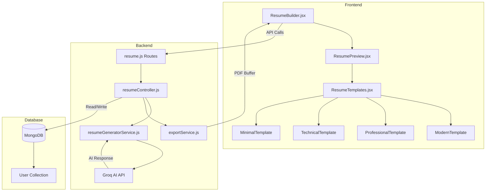
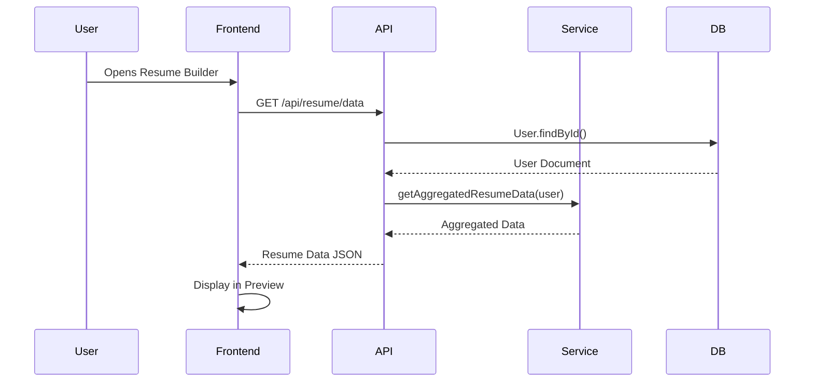
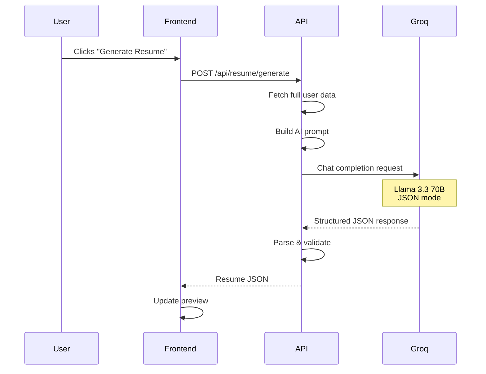
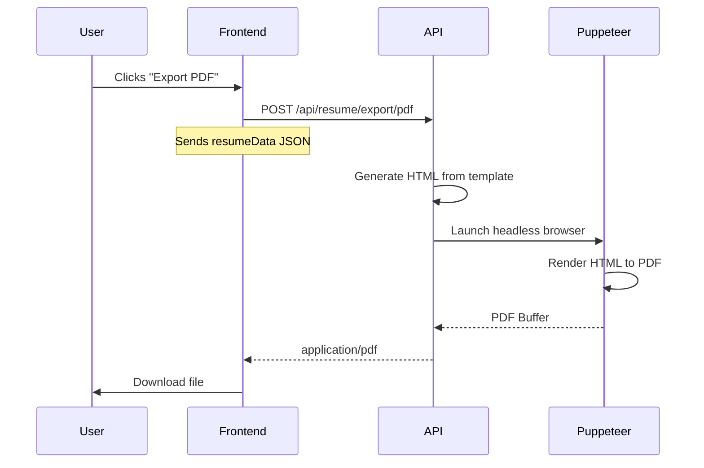

# AI Resume Builder - Complete Technical Documentation

## 📋 Table of Contents
1. [Overview](#overview)
2. [Architecture](#architecture)
3. [Data Flow](#data-flow)
4. [Frontend Components](#frontend-components)
5. [Backend Services](#backend-services)
6. [API Endpoints](#api-endpoints)
7. [Database Schema](#database-schema)
8. [AI Integration](#ai-integration)
9. [Export System](#export-system)

---

## Overview

The **AI Resume Builder** is an intelligent resume generation system that automatically creates professional, ATS-optimized resumes from user profile data using AI (Groq's Llama 3.3 70B model).

### Key Features
- ✅ **AI-Powered Generation**: Automatically generates professional summaries, experience descriptions, and skill categorizations
- ✅ **Multiple Templates**: 4 professional templates (Modern, Professional, Technical, Minimal)
- ✅ **Live Preview**: Real-time resume preview with template switching
- ✅ **PDF Export**: High-quality PDF generation using Puppeteer
- ✅ **Data Aggregation**: Pulls from profile, skills, education, experience, and certificates
- ✅ **Error Handling**: Comprehensive error boundaries and data sanitization

---

## Architecture

### System Architecture



### Technology Stack

#### Frontend
- **React** (v18+) - UI framework
- **React Router** - Navigation
- **Axios** - HTTP client
- **Lucide React** - Icons
- **Tailwind CSS** - Styling

#### Backend
- **Node.js** + **Express** - Server framework
- **MongoDB** + **Mongoose** - Database
- **Groq SDK** - AI integration (Llama 3.3 70B)
- **Puppeteer** - PDF generation
- **JWT** - Authentication

---

## Data Flow

### 1. Resume Data Aggregation Flow



**Data Sources:**
- `user.fullName`, `user.email`, `user.phoneNumber`
- `user.personalDetails.location`
- `user.socialLinks` (GitHub, LinkedIn, Portfolio)
- `user.education[]`
- `user.experience[]`
- `user.profile.completedSkills[]` (mastered skills with score ≥ 90)
- `user.profile.currentSkills[]`
- `user.certifications[]`
- `user.resumeData.projects[]`

### 2. AI Resume Generation Flow



### 3. PDF Export Flow



---

## Frontend Components

### 1. ResumeBuilder.jsx

**Location:** `src/pages/ResumeBuilder.jsx`

**Purpose:** Main container component for the resume builder interface.

#### State Management
```javascript
const [resumeData, setResumeData] = useState({
    versionName: 'My Professional Resume',
    template: 'professional',
    summary: '...',
    experience: [],
    education: [],
    skills: [],
    masteredSkills: [],
    projects: [],
    certificates: []
})
```

#### Key Functions

| Function | Purpose | API Endpoint |
|----------|---------|--------------|
| `fetchInitialData()` | Load user profile data | `GET /api/resume/data` |
| `handleGenerate()` | Trigger AI generation | `POST /api/resume/generate` |
| `handleExport()` | Export to PDF | `POST /api/resume/export/pdf` |

#### Data Sanitization Helpers
```javascript
const safe = (val, fallback) => val !== undefined && val !== null ? val : fallback
const safeArray = (val) => Array.isArray(val) ? val : []
const safeString = (val) => typeof val === 'string' ? val : ''
```

**Why?** Prevents crashes from malformed AI responses or missing data.

#### UI Structure
```
┌─────────────────────────────────────────┐
│ Header (Export PDF button)             │
├──────────────┬──────────────────────────┤
│ Left Sidebar │ Right Preview Panel      │
│              │                          │
│ AI Generator │ ┌──────────────────────┐ │
│ Card         │ │  ResumePreview       │ │
│              │ │  (Live Template)     │ │
│              │ └──────────────────────┘ │
└──────────────┴──────────────────────────┘
```

---

### 2. ResumePreview.jsx

**Location:** `src/components/resume/ResumePreview.jsx`

**Purpose:** Wrapper component with error boundary for safe template rendering.

#### Error Boundary
```javascript
class ResumeErrorBoundary extends Component {
    static getDerivedStateFromError(error) {
        return { hasError: true, error }
    }
    
    render() {
        if (this.state.hasError) {
            return <ErrorUI />
        }
        return this.props.children
    }
}
```

**Why?** Prevents white-screen crashes if template rendering fails.

#### Template Routing
```javascript
switch (data?.template || 'professional') {
    case 'modern': return <ModernTemplate data={data} />
    case 'professional': return <ProfessionalTemplate data={data} />
    case 'technical': return <TechnicalTemplate data={data} />
    case 'minimal': return <MinimalTemplate data={data} />
}
```

---

### 3. ResumeTemplates.jsx

**Location:** `src/components/resume/ResumeTemplates.jsx`

**Purpose:** Contains 4 resume template components.

#### Template Specifications

| Template | Style | Best For | Key Features |
|----------|-------|----------|--------------|
| **Modern** | Two-column, indigo accents | Creative roles | Sidebar layout, skill badges |
| **Professional** | Classic serif, centered | Corporate roles | Traditional ATS format |
| **Technical** | Monospace, code-style | Developer roles | Terminal aesthetic |
| **Minimal** | Ultra-clean, light typography | Design roles | Minimalist elegance |

#### Professional Template Header (Fixed)
```jsx
<div className="text-center border-b-2 border-slate-900 pb-6">
    <h1>{data.fullName}</h1>
    
    {/* Row 1: Phone • Email */}
    <div className="flex justify-center gap-2">
        {data.phoneNumber && <span>{data.phoneNumber}</span>}
        {data.phoneNumber && data.email && <span>•</span>}
        {data.email && <span>{data.email}</span>}
    </div>
    
    {/* Row 2: GitHub • LinkedIn • Portfolio */}
    {(data.github || data.linkedin || data.portfolio) && (
        <div className="flex justify-center gap-2">
            {data.github && <span className="truncate max-w-[180px]">
                {data.github.replace(/^https?:\/\//, '')}
            </span>}
            {/* ... */}
        </div>
    )}
</div>
```

**Key Fixes:**
- ✅ Two-row layout for contact info
- ✅ Conditional rendering (only show if exists)
- ✅ Truncation with `max-w-[180px]` to prevent overflow
- ✅ URL cleanup (removes `https://`)

---

## Backend Services

### 1. resumeGeneratorService.js

**Location:** `server/services/resumeGeneratorService.js`

**Purpose:** Aggregates user data from MongoDB into resume-ready format.

#### Core Function: `getAggregatedResumeData(user)`

**Input:** MongoDB User document  
**Output:** Resume data JSON

```javascript
{
    // Personal
    fullName: string,
    email: string,
    phoneNumber: string,
    location: { city, state, country },
    github: string,
    linkedin: string,
    portfolio: string,
    
    // Career
    education: [{ institution, degree, field, year }],
    experience: [{ company, role, duration, description }],
    masteredSkills: [{ skill, score }],
    knownSkills: string[],
    certificates: [{ name, issuer, year }],
    projects: [{ title, description, techStack }],
    targetJobRole: string
}
```

#### Data Mapping Logic

| User Schema Field | Resume Field | Transformation |
|-------------------|--------------|----------------|
| `user.education[].college` | `institution` | Direct map |
| `user.education[].specialization` | `field` | Direct map |
| `user.experience[].startDate` | `duration` | Format to "MMM YYYY - MMM YYYY" |
| `user.profile.completedSkills[]` | `masteredSkills` | Filter `score >= 90` |
| `user.certifications[]` | `certificates` | Filter `useInResume !== false` |

#### Validation Logging
```javascript
console.log('📊 Resume Data Validation:')
console.log(`   Full Name: ${fullName || '❌ MISSING'}`)
console.log(`   Education: ${education.length} entries`)
console.log(`   Mastered Skills: ${masteredSkills.length} skills`)
```

---

### 2. resumeController.js

**Location:** `server/controllers/resumeController.js`

**Purpose:** Handles HTTP requests for resume operations.

#### Key Controllers

##### `uploadAndParseResume(req, res)`
- Accepts PDF upload via Multer
- Extracts text using `pdf-parse`
- Parses skills/experience using regex
- Stores in `user.resumeData`

##### `generateResumeData(req, res)`
- Fetches user from DB
- Calls `getAggregatedResumeData()`
- Constructs AI prompt
- Calls Groq API
- Returns structured JSON

##### `exportResume(req, res)`
- Accepts `resumeData` JSON
- Generates HTML template
- Uses Puppeteer to render PDF
- Returns PDF buffer

---

## API Endpoints

### Resume Data Endpoints

#### `GET /api/resume/data`
**Auth:** Required  
**Purpose:** Get all data for resume builder

**Response:**
```json
{
    "fullName": "John Doe",
    "email": "john@example.com",
    "phoneNumber": "+1234567890",
    "location": { "city": "San Francisco", "state": "CA", "country": "USA" },
    "github": "https://github.com/johndoe",
    "linkedin": "https://linkedin.com/in/johndoe",
    "education": [...],
    "experience": [...],
    "masteredSkills": [...],
    "certificates": [...]
}
```

---

#### `POST /api/resume/generate`
**Auth:** Required  
**Purpose:** Generate AI-enhanced resume content

**Request Body:** None (uses authenticated user)

**AI Prompt Structure:**
```
You are an expert ATS-optimized resume writer.

USER DATA:
{...aggregated data...}

INSTRUCTIONS:
1. Summary: 3-4 sentence professional summary for [targetRole]
2. Experience: Expand into STAR-method bullet points
3. Skills: Categorize into logical groups
4. Format: Return ONLY valid JSON

EXPECTED JSON STRUCTURE:
{
  "summary": "string",
  "education": [...],
  "experience": [...],
  "skills": [{ "category": "...", "items": [...] }],
  "masteredSkills": [{ "name": "..." }],
  "projects": [...],
  "certificates": [...]
}
```

**Response:**
```json
{
    "message": "Resume generated successfully",
    "resume": {
        "summary": "Experienced software engineer...",
        "experience": [
            {
                "company": "Tech Corp",
                "role": "Senior Developer",
                "duration": "Jan 2020 - Present",
                "description": "• Led team of 5...\n• Improved performance by 40%..."
            }
        ],
        "skills": [
            { "category": "Languages", "items": ["JavaScript", "Python"] },
            { "category": "Frameworks", "items": ["React", "Node.js"] }
        ],
        "masteredSkills": [{ "name": "React" }, { "name": "Node.js" }]
    }
}
```

---

#### `POST /api/resume/export/pdf`
**Auth:** Required  
**Purpose:** Export resume as PDF

**Request Body:**
```json
{
    "resumeData": {
        "fullName": "John Doe",
        "template": "professional",
        ...
    }
}
```

**Response:** Binary PDF file  
**Content-Type:** `application/pdf`  
**Filename:** `{fullName}_Resume.pdf`

---

### Upload & Analysis Endpoints

#### `POST /api/resume/upload`
**Auth:** Required  
**Purpose:** Upload and parse resume PDF

**Request:** `multipart/form-data` with `resume` file field  
**Max Size:** 5MB

**Response:**
```json
{
    "message": "Resume uploaded and parsed successfully",
    "resumeData": {
        "skills": ["JavaScript", "React", "Node.js"],
        "tools": ["Git", "Docker"],
        "projects": [...],
        "experience": [...]
    }
}
```

---

#### `POST /api/resume/analyze`
**Auth:** Required  
**Purpose:** Analyze skill gap vs target role

**Request Body:**
```json
{
    "userId": "user_id_here"
}
```

**Response:**
```json
{
    "analysis": {
        "matchPercentage": 75,
        "matchingSkills": ["React", "Node.js"],
        "missingSkills": ["AWS", "Docker"],
        "industryDemandSkills": ["Kubernetes", "CI/CD"]
    },
    "recommendations": [...],
    "roadmap": [...]
}
```

---

## Database Schema

### User Model - Resume Fields

```javascript
{
    // Personal Info
    fullName: String,
    email: String,
    phoneNumber: String,
    
    personalDetails: {
        location: {
            city: String,
            state: String,
            country: String
        }
    },
    
    socialLinks: {
        github: String,
        linkedin: String,
        portfolio: String
    },
    
    // Education
    education: [{
        college: String,
        degree: String,
        specialization: String,
        startYear: Number,
        endYear: Number
    }],
    
    // Experience
    experience: [{
        company: String,
        role: String,
        startDate: Date,
        endDate: Date,
        responsibilities: String
    }],
    
    // Skills
    profile: {
        completedSkills: [{
            skill: String,
            score: Number,
            masteredAt: Date
        }],
        currentSkills: [String],
        targetJob: String
    },
    
    // Certificates
    certifications: [{
        title: String,
        issuer: String,
        issueYear: Number,
        useInResume: Boolean
    }],
    
    // Parsed Resume Data
    resumeData: {
        skills: [String],
        tools: [String],
        projects: [{
            title: String,
            description: String,
            techStack: [String]
        }],
        parsedAt: Date
    },
    
    // Resume File
    resumeFile: {
        filename: String,
        uploadedAt: Date,
        filePath: String
    }
}
```

---

## AI Integration

### Groq Configuration

**Model:** `llama-3.3-70b-versatile`  
**API:** Groq Cloud API  
**Response Format:** JSON mode (structured output)

### Prompt Engineering

#### System Prompt
```
You are a professional resume generator. You only output valid JSON.
```

#### User Prompt Structure
1. **Context:** User data (profile, skills, experience)
2. **Instructions:** Specific formatting requirements
3. **Schema:** Expected JSON structure
4. **Constraints:** ATS optimization, STAR method, categorization

### AI Response Handling

```javascript
// 1. Call Groq
const completion = await groq.chat.completions.create({
    messages: [
        { role: 'system', content: 'You are a professional resume generator...' },
        { role: 'user', content: prompt }
    ],
    model: 'llama-3.3-70b-versatile',
    response_format: { type: 'json_object' }
})

// 2. Parse response
const aiResponse = JSON.parse(completion.choices[0].message.content)

// 3. Sanitize (frontend)
const sanitized = {
    summary: safeString(raw.summary),
    education: safeArray(raw.education).map(e => ({
        institution: safeString(e?.institution),
        degree: safeString(e?.degree),
        field: safeString(e?.field),
        year: safeString(e?.year)
    })),
    // ... more sanitization
}
```

---

## Export System

### PDF Generation (Puppeteer)

**Service:** `exportService.js`

#### Process Flow
1. **Generate HTML** from resume data
2. **Launch headless Chrome** via Puppeteer
3. **Render HTML** to PDF with A4 dimensions
4. **Return buffer** to client

#### HTML Template Generation
```javascript
function generateResumeHtml(resumeData) {
    return `
        <!DOCTYPE html>
        <html>
        <head>
            <style>
                @page { size: A4; margin: 0; }
                body { font-family: 'Times New Roman', serif; }
                /* ... template styles ... */
            </style>
        </head>
        <body>
            <div class="resume">
                <h1>${resumeData.fullName}</h1>
                <!-- ... resume content ... -->
            </div>
        </body>
        </html>
    `
}
```

#### Puppeteer Configuration
```javascript
const browser = await puppeteer.launch({
    headless: true,
    args: ['--no-sandbox', '--disable-setuid-sandbox']
})

const page = await browser.newPage()
await page.setContent(htmlContent, { waitUntil: 'networkidle0' })

const pdfBuffer = await page.pdf({
    format: 'A4',
    printBackground: true,
    margin: { top: '0.5in', bottom: '0.5in', left: '0.5in', right: '0.5in' }
})

await browser.close()
return pdfBuffer
```

---

## Error Handling

### Frontend Error Boundaries

**Component:** `ResumeErrorBoundary` in [ResumePreview.jsx](file:///c:/careertracker/skill-career-tracker/src/components/resume/ResumePreview.jsx)

**Catches:**
- Template rendering crashes
- Malformed data access
- Missing required fields

**Fallback UI:**
```jsx
<div className="error-container">
    <AlertTriangle />
    <h3>Resume Preview Error</h3>
    <p>The resume template crashed while rendering...</p>
    <button onClick={retry}>Try Again</button>
</div>
```

### Backend Error Handling

#### Authentication Errors
```javascript
if (!token) {
    return res.status(401).json({ error: 'Authentication required' })
}
```

#### Validation Errors
```javascript
if (!user.resumeData || user.resumeData.skills.length === 0) {
    return res.status(400).json({ error: 'No resume data found' })
}
```

#### AI Generation Errors
```javascript
try {
    const completion = await groq.chat.completions.create(...)
} catch (error) {
    console.error('AI Generation Fatal Error:', error)
    res.status(500).json({ error: `Generation failed: ${error.message}` })
}
```

---

## Security Considerations

### Authentication
- ✅ JWT token verification on all endpoints
- ✅ User ownership validation (req.user._id)

### File Upload
- ✅ File type validation (PDF only)
- ✅ File size limit (5MB)
- ✅ Secure file storage with unique filenames

### Data Sanitization
- ✅ Frontend: `safe()`, `safeArray()`, `safeString()` helpers
- ✅ Backend: Mongoose schema validation
- ✅ AI responses: JSON parsing with try-catch

### API Rate Limiting
> **Note:** Consider implementing rate limiting for AI generation endpoint to prevent abuse.

---

## Performance Optimizations

### Frontend
- **Memoization:** Use `useMemo` for expensive computations
- **Debouncing:** Template switching transitions
- **Lazy Loading:** Load templates on-demand

### Backend
- **Caching:** Cache aggregated user data (Redis)
- **Database Indexing:** Index on `userId`, `email`
- **Connection Pooling:** MongoDB connection pool

### AI
- **Prompt Optimization:** Minimize token usage
- **Response Streaming:** Stream AI responses (future)

---

## Future Enhancements

### Planned Features
- [ ] **DOCX Export** (Word format)
- [ ] **Resume Versions** (save multiple versions)
- [ ] **Custom Sections** (add custom resume sections)
- [ ] **Real-time Collaboration** (share resume for feedback)
- [ ] **ATS Score** (analyze ATS compatibility)
- [ ] **Cover Letter Generator** (AI-generated cover letters)

### Technical Improvements
- [ ] **WebSocket Updates** (real-time preview updates)
- [ ] **Server-Side Rendering** (faster initial load)
- [ ] **CDN Integration** (faster asset delivery)
- [ ] **A/B Testing** (template effectiveness)

---

## Troubleshooting Guide

### Common Issues

#### Issue: "Failed to load resume data"
**Cause:** User not authenticated or missing profile data  
**Solution:** Check JWT token, ensure user has completed profile

#### Issue: "AI generation returns empty arrays"
**Cause:** Insufficient user data or AI prompt issues  
**Solution:** Check console logs for data validation warnings, verify user has skills/experience

#### Issue: "PDF export fails"
**Cause:** Puppeteer not installed or missing dependencies  
**Solution:** Run `npm install puppeteer` and install Chrome dependencies

#### Issue: "Template crashes on render"
**Cause:** Malformed data (e.g., `skills.items` is string instead of array)  
**Solution:** Check error boundary logs, add more sanitization

---

## Development Workflow

### Local Setup
```bash
# Backend
cd server
npm install
npm run dev

# Frontend
cd ..
npm install
npm run dev
```

### Environment Variables
```env
# Backend (.env)
GROQ_API_KEY=your_groq_api_key
JWT_SECRET=your_jwt_secret
MONGODB_URI=mongodb://localhost:27017/careertracker
```

### Testing
```bash
# Test resume generation
curl -X POST http://localhost:5000/api/resume/generate \
  -H "Authorization: Bearer YOUR_TOKEN"

# Test PDF export
curl -X POST http://localhost:5000/api/resume/export/pdf \
  -H "Authorization: Bearer YOUR_TOKEN" \
  -H "Content-Type: application/json" \
  -d '{"resumeData": {...}}' \
  --output resume.pdf
```

---

## Conclusion

The AI Resume Builder is a sophisticated system that combines:
- **Data aggregation** from multiple user profile sources
- **AI-powered content generation** using Groq's Llama 3.3 70B
- **Professional templates** with ATS optimization
- **Robust error handling** and data sanitization
- **High-quality PDF export** via Puppeteer

This documentation serves as a complete reference for understanding, maintaining, and extending the Resume Builder feature.
