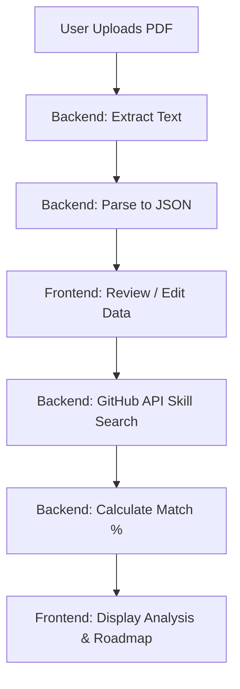

# Resume System Implementation Overview

This document provides a detailed technical breakdown of how the Resume Analysis and Intelligence system is implemented in the platform.

## Architecture Overview

The system follows a typical client-server architecture:
1.  **Frontend**: React components for file upload, data preview, and visualization of analysis results.
2.  **Backend**: Express.js routes and controllers that orchestrate parsing and analysis logic.
3.  **Services**: Specialized logic for PDF text extraction, structured data parsing, and AI-driven skill gap analysis.
4.  **Storage**: MongoDB (via Mongoose) stores both the parsed resume data and the analysis results within the User model.

---

## 🏗️ Backend Implementation

The backend is located in the `server/` directory and is built using Node.js and Express.

### 1. API Routes (`server/routes/resume.js`)
Handles the endpoint definitions and applies authentication middleware.
- `POST /api/resume/upload`: Accepts a PDF file via `multer` memory storage.
- `POST /api/resume/analyze`: Triggers the skill gap analysis logic.
- `GET /api/resume/:userId`: Retrieves stored resume data and analysis results.
- `PUT /api/resume/:userId`: Allows manual updates to parsed data.
- `DELETE /api/resume/:userId`: Removes resume files and associated data.

### 2. Controller Logic (`server/routes/resumeController.js`)
Coordinates the flow between services and the database.
- **Upload Flow**: Receives the file -> Saves to `uploads/resumes/` -> Calls `resumeParserService` -> Updates User document.
- **Analysis Flow**: Fetches user skills -> Calls `resumeAnalyzerService` (GitHub API/Fallback) -> Generates match percentage and roadmap -> Updates User document.

### 3. Parsing Service (`server/services/resumeParserService.js`)
- **Text Extraction**: Uses the `pdf-parse` library to extract raw text from PDF buffers.
- **Structured Parsing**: Employs complex Regex patterns and section detection algorithms to identify:
    - **Personal Info**: Email, phone, URLs.
    - **Technical Skills & Tools**: Extracted from a dedicated section and normalized.
    - **Experience**: Detects company names, roles, durations, and descriptions.
    - **Education**: Identifies institutions, degrees, and graduation years.
    - **Projects & Certifications**: Extracts title, tech stack, and metadata.

### 4. Analysis Service (`server/services/resumeAnalyzerService.js`)
- **Industry Insight**: Fetches real-time industry demand by searching popular repositories on **GitHub** via the GitHub API (using the target job role).
- **Skill Matching**: Compares normalized user skills against industry-demanded skills.
- **Gap Identification**: Determines which skills are missing and categorizes them by importance (Critical, Important, Nice-to-have).
- **Roadmap Generation**: Distributes missing skills across a 4-phase learning journey (Foundation, Intermediate, Advanced, Specialization).

---

## 🎨 Frontend Implementation

The frontend is built with React and Tailwind CSS, located in `src/components/`.

### 1. Dashboard Orchestrator (`ResumeDashboard.jsx`)
- Manages the overall state of the resume feature.
- Implements tab-based navigation: **Upload**, **Preview**, and **Analysis**.
- Handles data fetching and persistence after backend updates.

### 2. Upload Interface (`ResumeUploadForm.jsx`)
- Provides a premium drag-and-drop zone.
- Implements file validation (PDF only, size limits).
- Uses `FormData` to transmit the file to the backend.

### 3. Data Preview & Editor (`ResumePreview.jsx`)
- Renders the parsed data in structured cards (Experience, Skills, etc.).
- **Live Editing**: Allows users to manually correct any mis-parsed information before running the analysis.
- Calls the `/analyze` endpoint to transition to the result view.

### 4. Visualization Components
- **`SkillGapAnalysis.jsx`**: 
    - Displays a "Match Percentage" progress bar.
    - Compares "Matched Skills" vs "Missing Skills" in a side-by-side grid.
    - Shows categorized learning recommendations.
- **`SkillRoadmap.jsx`**:
    - Renders a vertical timeline of the 4-phase learning plan.
    - Each phase includes specific skills to learn and a high-level goal.

---

## 🛠️ Key Technologies Used

| Layer | Technology |
| :--- | :--- |
| **Parsing** | `pdf-parse`, Regular Expressions |
| **Backend** | Node.js, Express, Multer |
| **Database** | MongoDB, Mongoose |
| **AI/Data** | GitHub API (Industry Discovery) |
| **Frontend** | React, Tailwind CSS |
| **State Management** | React `useState` & `useEffect` |

## 🔄 Data Flow Summary

