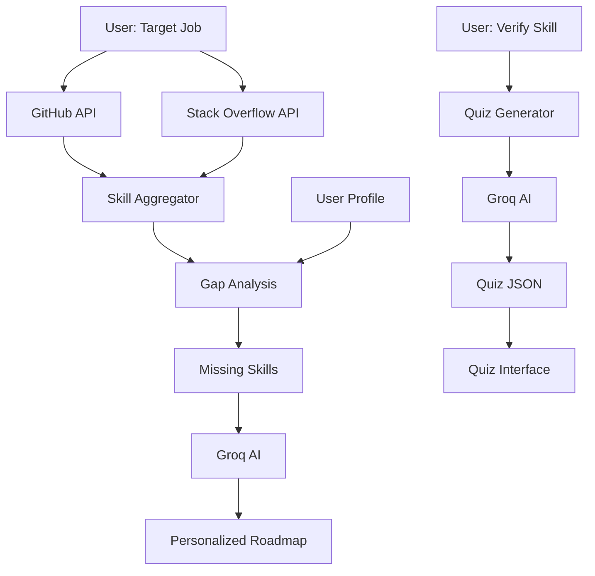

# Skill Generation & Verification System

This document outlines the technical implementation of the **Skill Generation** (Roadmap) and **Skill Verification** (Quiz) features in the Career Path Tracker.

## 🚀 Overview
The system uses a hybrid approach combining **Real-time Data** (GitHub, Stack Overflow) and **Generative AI** (Groq/Llama-3) to create accurate, up-to-date, and personalized learning experiences.

---

## 1. 🗺️ Dynamic Roadmap Generation
**File:** `server/services/roadmapGenerator.js`

The roadmap generation process discovers relevant skills for a specific job role and creates a structured learning path.

### 🔍 Data Sources
1.  **GitHub API (Primary Source)**:
    - Searches for popular repositories (`stars:>100`, pushed > 2023) related to the target job (e.g., "Full Stack Developer").
    - Analyzes `languages` and `topics` from these repositories.
    - **Why?** Ensures skills are based on what is actually being used in modern open-source projects.

2.  **Stack Overflow API (Supplementary)**:
    - Fetches popular `tags` related to the job title keywords.
    - **Why?** Captures community trends and problem-solving tools that might not be main repo languages.

### ⚙️ Generation Process
1.  **Fetch & Aggregate**:
    - Queries GitHub & Stack Overflow.
    - Normalizes skill names (e.g., "reactjs" -> "React").
    - Filters against a **Technical Skill Whitelist** to remove noise (e.g., "documentation", "interview").
2.  **Gap Analysis**:
    - Compares the identified **Required Skills** against the user's **Mastered Skills**.
    - Identifies **Missing Skills** to focus the learning path on.
3.  **AI Enrichment (Groq)**:
    - Sends the list of *Missing Skills* to Groq AI (Llama-3 model).
    - **Prompt Objective**: "Create learning recommendations... Categorize into High/Medium/Low priority... Provide resources."
    - **Output**: JSON object with priority levels, estimated timeline, and curated resource links (YouTube, Docs).

### 🛠️ Key Algorithms
- **Frequency Ranking**: Skills appearing more often in GitHub repos are ranked higher.
- **Role Defaults**: Fallback lists for specific roles (e.g., Cybersecurity, DevOps) if API data is sparse.

---

## 2. 📝 Skill Verification (AI Quizzes)
**File:** `server/services/quizGenerator.js`

To verify skill mastery, the system generates on-demand assessments.

### 🧠 AI Quiz Engine
- **Trigger**: User clicks "Take Quiz" for a specific skill.
- **Model**: Groq (Llama-3-70b-versatile).
- **Prompt Logic**:
    - "Create a certification test for [Skill Name]".
    - "Generate EXACTLY 25 Multiple Choice Questions".
    - "Difficulty: Mixed (Basic, Intermediate, Advanced)".
    - "Return purely JSON".

### 🛡️ Reliability & Fallbacks
- **JSON Parsing**: Robust handling of AI responses (stripping markdown, handling wrapper objects).
- **Rate Limiting**: If the AI API limit is reached (`429 Too Many Requests`), the system automatically serves a **Fallback Quiz** (`data/fallbackQuiz.js`) to ensure continuous user experience.

---

## ⚙️ Configuration & Environment
To enable these features, the following environment variables are required in `server/.env`:

```env
# AI Service
GROQ_API_KEY=gsk_...

# Data Sources
GITHUB_TOKEN=ghp_...
```

## 🧩 Data Flow Diagram


